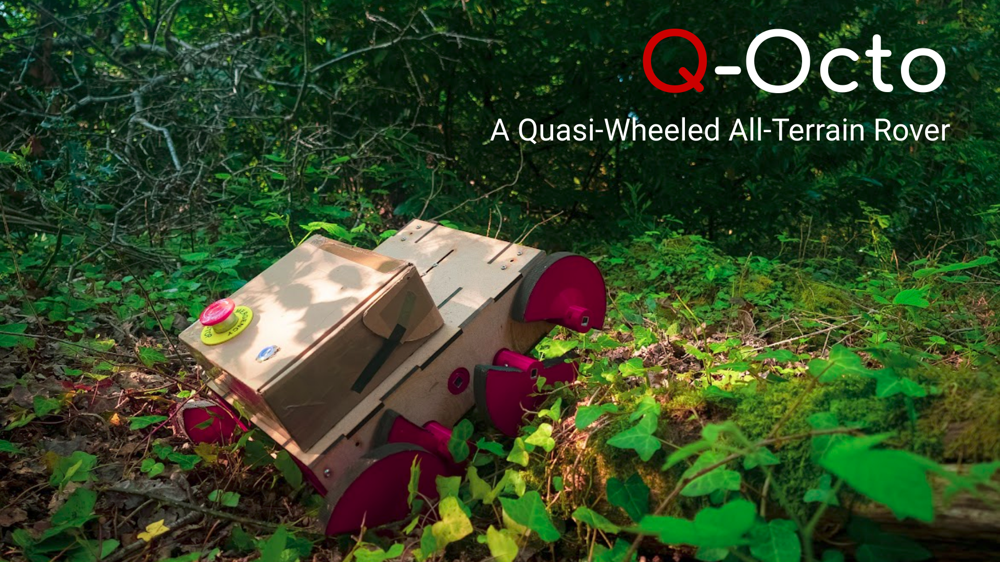
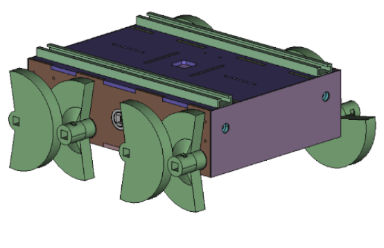
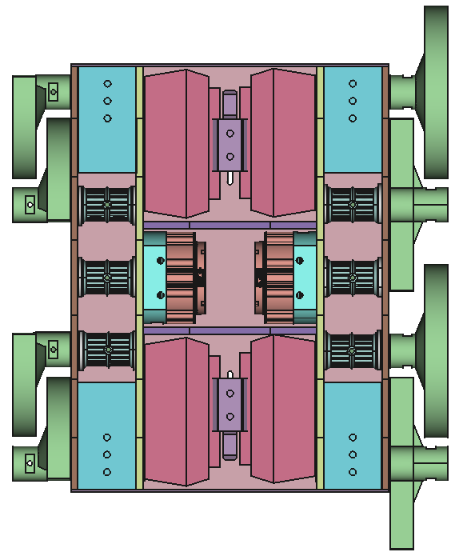

# Q-Octo

 

## About Q-Octo

YouTube Video: https://www.youtube.com/watch?v=2PIdxYJO_Ck.

Q-Octo uses a pair of [CyberGear MicroMotors](https://www.aliexpress.com/item/1005005997659365.html), which provide not only high torque and speed but also feedback such as current amp draw and position. To power the motors, 4 [Parkside X20V](https://parkside-diy.com/gb/battery-technology/x20v-team) drill batteries are used, providing 6-hour continuous runtime paired with robust and safe recharging.

Q-Octo is controlled via a Raspberry Pi Pico with the display and web server managed via a Raspberry Pi Pico W.
The main pico communicates with the [radio controller](https://github.com/q-octo/transmitter) to receive control commands however, navigation via a separate onboard computer or via a flight controller is planned.

To build a Q-Octo, both a 3D printer and a laser cutter are required. It is sufficient to manufacture all 3D printed parts out of [Esun PLA+](https://www.esun3d.com/pla-pro-product/), providing excellent durability. All laser-cut parts (*except the front and rear battery cover) can be cut from 6mm thick plyboard, which provides adequate rigidity and durability, assuming it is coated in outdoor paint.

## Related Repositories

* CAD design: https://github.com/JoshPattman/q-octo-cad
* CRSF Reciever for the RP2040 (Raspberry Pi Pico): https://github.com/britannio/pico_crsf
* EdgeTX transmitter script: https://github.com/q-octo/transmitter

## Setup

These instructions are currently just notes that we made during development.
Complete instructions will be produced if there is demand.

1. Clone this repo.
2. Run `git submodule update --init`.

VSCode with the PlatformIO extension or CLion with the PlatformIO Plugin is recommended.

### Web Dashboard

`curl -fsSL https://bun.sh/install | bash` (https://bun.sh/docs/installation#installing)

## Windows Footguns

* https://arduino-pico.readthedocs.io/en/latest/platformio.html#current-state-of-development
* https://github.com/earlephilhower/arduino-pico?tab=readme-ov-file#windows-specific-notes

## Licensing and Credits

* Flatbuffers
* Adafruit CAN
* DFR0534 (for voice module)
* Libcanard
* pico_crsf
* Pimoroni pico display
* cybergear
* CRC

Q-Octo was originally designed for [ELEC6212: Biologically Inspired Robotics](https://www.southampton.ac.uk/courses/modules/elec6212), a fourth year module at the University of Southampton.
